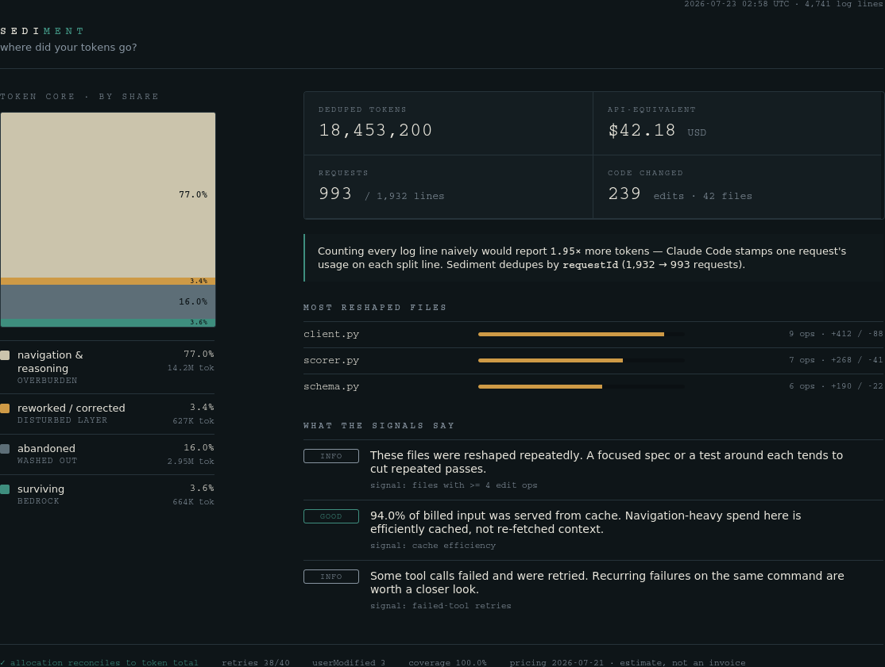

<div align="center">

# 🪨 Sediment

### Where did your tokens go?

A read-only, local-only analytics tool for Claude Code usage that answers the question
usage dashboards dodge: of the tokens you spent, what fraction produced work that
**survived** — versus was reworked, corrected, abandoned, or spent navigating?

[](https://github.com/Rohanrsp14/Sediment/actions/workflows/ci.yml)
[](LICENSE)
[](package.json)
[](package.json)
[](test)

</div>

<br>

<p align="center">
  
  <br>
  <sub>Synthetic demo data — the dashboard is a self-contained offline HTML file generated by <code>sediment report --html</code>.</sub>
</p>

<br>

## Contents

- [Why it exists](#why-it-exists)
- [The centerpiece: token allocation](#the-centerpiece-token-allocation)
- [Two correctness problems most token-usage tools get wrong](#two-correctness-problems-most-token-usage-tools-get-wrong)
- [Usage](#usage)
- [Dashboard](#dashboard)
- [Pricing](#pricing)
- [Privacy](#privacy)
- [Development](#development)
- [Status](#status)

<br>

## Why it exists

Most tools measure the river — how many tokens flowed. **Sediment measures the sediment** — what settled and stayed.

Vendor usage pages tell you *how many* tokens you used. They don't tell you whether those tokens bought lasting work. Sediment reconstructs that from the JSONL transcripts Claude Code already writes to `~/.claude/projects`, using ground truth most usage tools skip: the applied diff (`structuredPatch`), the human-correction flag (`userModified`), and per-request billing identity (`requestId`) — not the request arguments, not a guess.

No LLM-as-judge. No composite "productivity" score. Value — was the code *good*? — is unknowable from logs and is never claimed. Sediment measures **retention**: did the work survive. That's deterministic, and it's the honest question a usage dashboard can actually answer.

<br>

## The centerpiece: token allocation

Every deduplicated request's tokens are attributed to exactly one outcome bucket, and the buckets **sum exactly to the token total** — an asserted invariant, checked in CI on every run. It's a breakdown, not a score:

```
token allocation:
  surviving            █·······················   6.2%   edits that stuck
  reworked/corrected   ██······················   7.7%   superseded, or human-corrected
  abandoned            ························   0.0%   edits in sessions left hanging
  navigation/reasoning █████████████████████···  86.1%   reads, bash, thinking (no edit)
```

*(numbers above are illustrative — run `sediment report` on your own history to see yours)*

The typical finding: the large majority of agent token spend is *navigation and reasoning*, not editing — and among editing work, superseded attempts can outweigh the versions that survived. Every number in the allocation is auditable down to the request that produced it.

<br>

## Two correctness problems most token-usage tools get wrong

Building Sediment surfaced two ground-truth defects that are easy to miss and produce meaningfully wrong numbers. Both are verified against a real Claude Code transcript:

| | The problem | The fix | Verified impact |
|---|---|---|---|
| **Token accounting** | Claude Code splits one assistant API response across multiple JSONL lines and stamps the *same* `usage` on each. Naive per-line summing over-counts. | Deduplicate by `requestId` before summing. | **1.88×** inflation on billed input, **2.29×** on output, on a real 1,081-line transcript. |
| **Edit reconstruction** | Reconstructing edits from tool *arguments* (`old_string`/`new_string`) counts unchanged context lines inside the replaced block as churn. | Reconstruct from `toolUseResult.structuredPatch` — the actual applied minimal diff. | Argument-based counting over-counted additions **~2.2×** and deletions **~5×** on the same transcript. |

<br>

## Usage

```bash
node bin/sediment.mjs [path]              # full snapshot (default); path defaults to ~/.claude/projects
node bin/sediment.mjs report [path] --json --out snapshot.json
node bin/sediment.mjs report [path] --html dashboard.html      # generate the dashboard
node bin/sediment.mjs doctor [path]       # schema-conformance scan (fails loud on unknown log surfaces)
node bin/sediment.mjs tokens [path]       # deduped token accounting + inflation vs naive summing
node bin/sediment.mjs tokens [path] --audit <requestId>   # collapse one request by hand
node bin/sediment.mjs cost [path]         # API-equivalent cost with honest coverage
node bin/sediment.mjs edits [path]        # code changes reconstructed from applied diffs
node bin/sediment.mjs allocation [path]   # the token-allocation centerpiece
node bin/sediment.mjs schema              # the machine-readable output contract
```

Every command supports `--json`. The JSON snapshot (`sediment report --json`) is the single source the dashboard reads — the UI is a view over the CLI, never a second computation.

> **Windows PowerShell note:** `~` is a shell shortcut that PowerShell does **not** expand the way bash does. Don't pass `~/.claude/projects` as a path argument — either omit the path entirely (the default already resolves correctly on any OS) or use `$env:USERPROFILE\.claude\projects` explicitly. If a path resolves to zero `.jsonl` files, Sediment fails loudly with a clear message rather than silently rendering an all-zero report.

<br>

## Dashboard

```bash
node bin/sediment.mjs report [path] --html dashboard.html
```

Writes a self-contained, offline HTML dashboard — a stratigraphic "core-log" of your token allocation (navigation as overburden, surviving edits as bedrock), the headline numbers, most-reshaped files, and rule-based guidance notes. It is a pure view over the JSON snapshot: it recomputes nothing, makes no network calls, and embeds its own data.

<br>

## Pricing

`pricing.json` is an editable, date-scoped table verified against Anthropic's official pricing (2026-07-21). Each request is priced at the rate in effect on its own date, so it stays correct across scheduled changes (e.g. Claude Sonnet 5's introductory→standard boundary on 2026-09-01). API-equivalent cost is an **estimate, not an invoice** — it excludes batch discounts, the US `inference_geo` multiplier, fast-mode premiums, and server-tool charges. A model matching no row stays unpriced and lowers reported coverage rather than being silently guessed.

<br>

## Privacy

The tool only reads local transcript files and computes; it makes no network calls and writes nothing to your Claude state directories. Your transcripts contain prompts, file paths, and code — treat any exported JSON or dashboard as sensitive. `.gitignore` excludes generated snapshots/dashboards and any real `.jsonl` by default; only the synthetic fixture under `fixtures/` is tracked.

<br>

## Development

```bash
npm test          # node --test — full suite (61 tests)
npm run check     # syntax-check every module
```

Tests run entirely on synthetic fixtures under `fixtures/` and CLI-level fixtures; no real transcript is committed. CI runs the full suite on Node 18/20/22 on every push, and separately verifies no stray `.jsonl` outside `fixtures/` was ever committed.

<br>

## Status

**v1 complete (CP0–CP6):** schema conformance · deduped tokens · date-scoped cost · edit reconstruction · token allocation · unified report + output contract · guidance notes + dashboard. Each checkpoint was verified against a real transcript. 61 tests, zero runtime dependencies. See [`docs/spec_v1.md`](docs/spec_v1.md) and [`docs/PROGRESS.md`](docs/PROGRESS.md).

<br>

<div align="center">
<sub>MIT licensed. Built with a spec-first, eval-driven discipline — see <a href="CLAUDE.md">CLAUDE.md</a> for the ground rules this project doesn't break.</sub>
</div>
